# Visual intro

Let's discover **Plotyl JS visual in 5 min**.

## What you'll need

- [Power BI Desktop](https://powerbi.microsoft.com/desktop/) or Power BI Service:
- [Microsoft work account](https://app.powerbi.com/singleSignOn?) under an organization's email
- [Sample](https://learn.microsoft.com/en-us/create-reports/sample-datasets) or your own dataset
    
## Getting Started

1. Import the visual from Appsource in Power BI Desktop.
    
    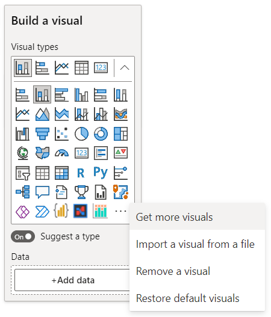
    
    On the Visualizations pane, click on <code>...</code> and select <code>Get more visuals</code>

2. Type <code>PlotlyJS</code> in the search bar to find the visual:
    
    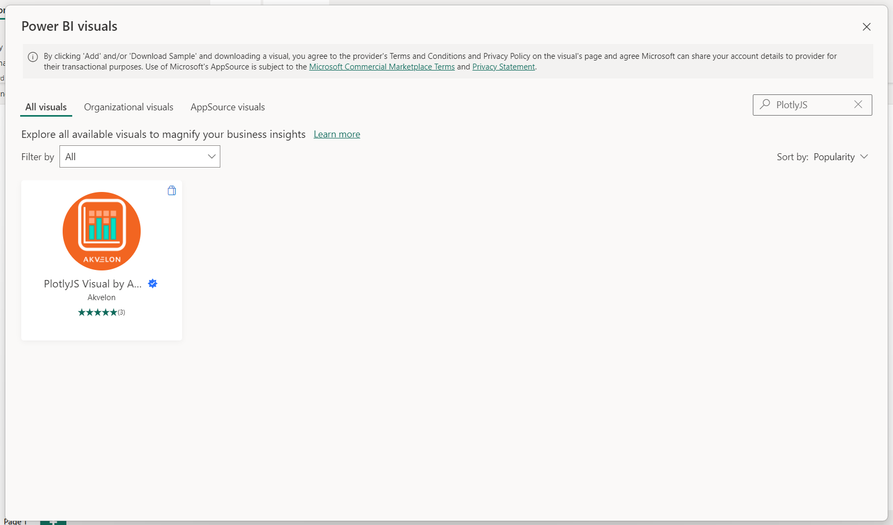
    
    Then click on the PlotlyJS Visual icon to open the visual page.
    
    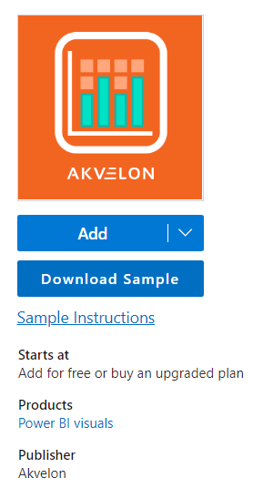

3. Click on <code>Add</code> to load the visual into Power BI Desktop.

4. Switch the visual to PlotlyJS Visual by clicking on the PlotlyJS Visual icon.
    
    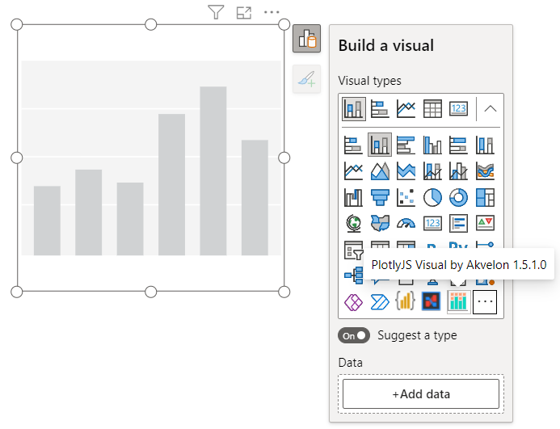

5. Assign data to the visual:
    
    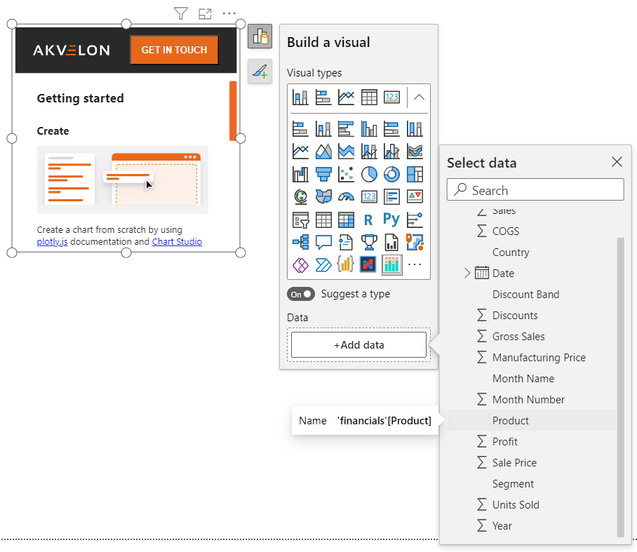
    
    Click on <code>+Add data</code> under the Data section of the panel and select columns from the table that you would like to be included in the visualization.

6. Switch to edit mode by clicking on <code>...</code> to open the visual menu and selecting <code>Edit</code>.

    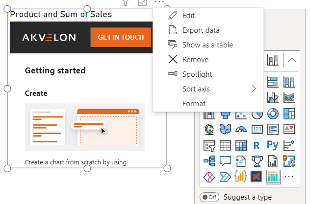
    
    The visual will open in focus mode and will launch Chart studio.
    
    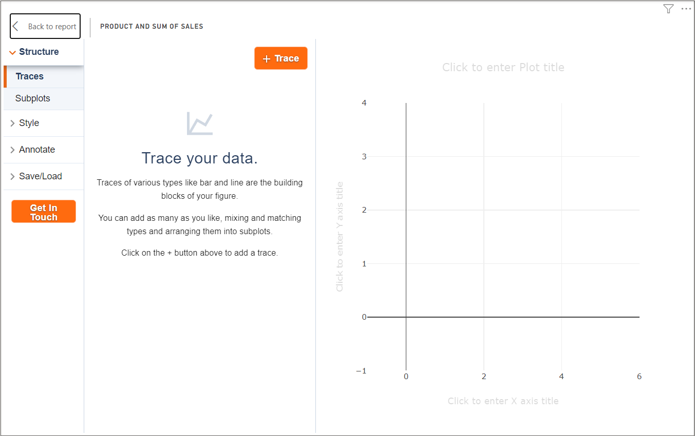
    
### Configuring the Simple Chart

1. Click on the <code>+Trace</code> button to start configuring the chart

    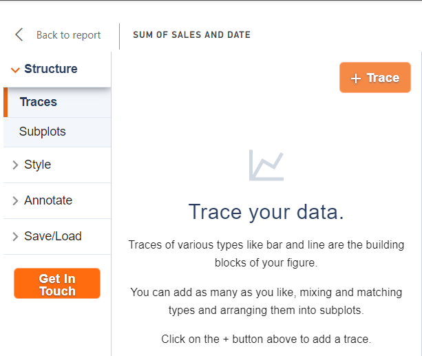

2. Switch the trace by clicking on <code>Scatter</code> type:

    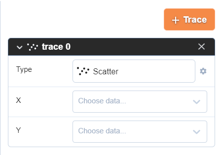

3. Select the Line chart:

    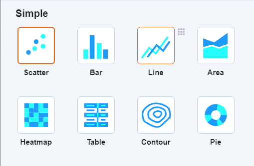

4. Assign columns to <code>X</code> and <code>Y</code> axes

    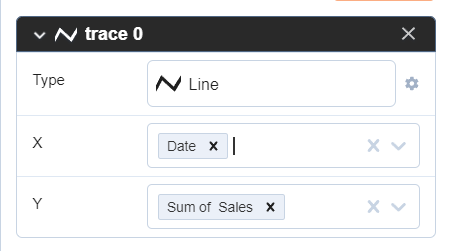
    
    The result:
    
    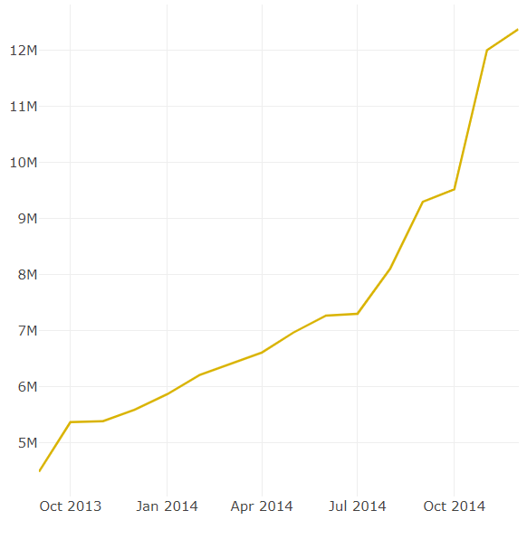

5. Save the chart by selecting <code>Save/load</code> / <code>JSON</code> tab and clicking on the <code>Save</code> button 

    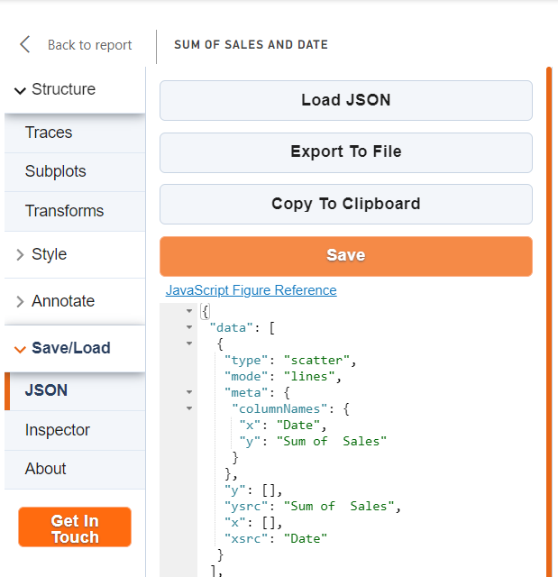

6. Click on the <code>Back to report</code> button to exit from the Chart studio and see the result:
    
    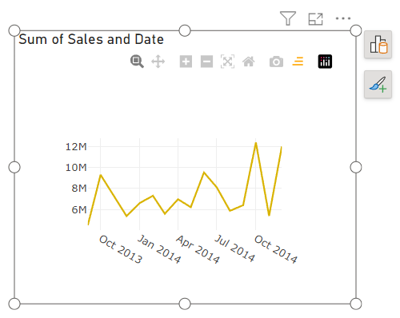

