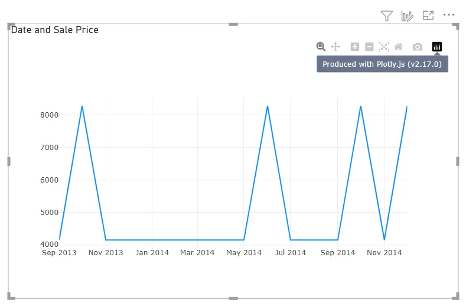

# PlotlyJS visual overview

Akvelon’s PlotyJS Visual was created to connect data in Power BI and the capabilities of the Plotly.js visualization library, allowing users to reuse knowledge and existing solutions in their Power BI reports and dashboards.

This visual supports the same charting schemas as Chart Studio, making it easy to migrate charts from other platforms that also use the Plotly library, such as Streamlit and Dash data apps.

If you want a quick overview of the visual, watch this video by Kerry Kolosko and Reid Havens, in which they share their experience with using the visual.

## Declarative

Plotly.js charts are described declaratively as JSON objects. Every aspect of the charts, such as the colors, grid lines, legend, data, axes, and data source, has a corresponding set of JSON attributes. Usually, charts render with SVG and offer great compatibility across browsers and publication-quality vector image export. However, Plotly.js also supports WebGL rendering using [stack.gl](http://stack.gl/) for 2D and 3D charts. The library is universal and is used for browser abstraction for [Python](https://plotly.com/python/), [R](https://plotly.com/r/), and [MATLAB](https://plotly.com/matlab/)

See [JavaScript Figure Reference of Plotly.js](https://plotly.com/javascript/reference/)

### Chart Studio

Chart Studio is a React component for creating & editing D3 charts. The component allows you to build your own editor or configuration of editor to enable users to build Plotly charts by using UI instead of JSON document.
