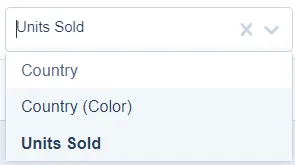
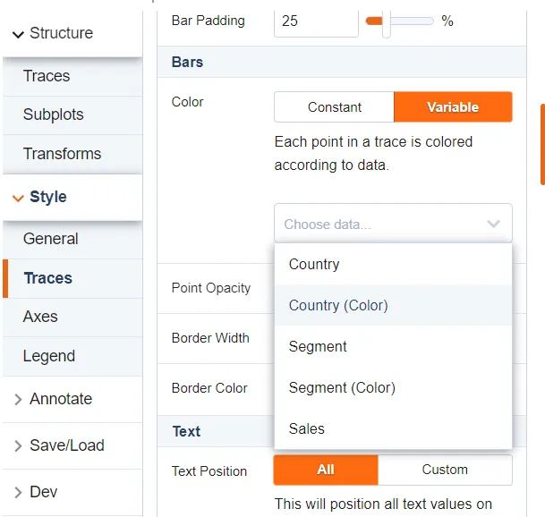
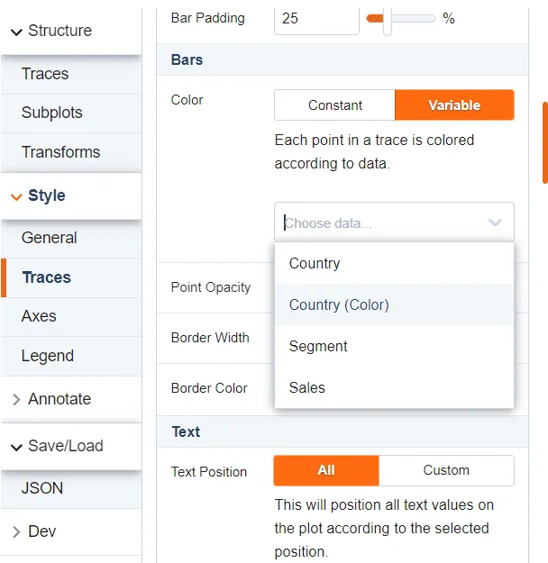

# Color columns

The visual creates additional colors for each categorical column value. In the trace configuration section, you can see those columns:



This allows users to bind the Power BI color palette to Plotly.js objects:



If you need to create color columns only for specific columns, you can define the columns list in the “powerbi” property of the JSON document (it is custom property and it is not part of the Plotly.js library):

```json
{
    "data": [
    ...
    ],
    "layout": {
    ...
    },
    "frames": [],
    "powerbi": {
        "colorColumns": ["Country"]
    }
}
```

After that, the visual generates colors only for those columns:



## Colorway property

The visual also assigns the Power BI colors to the “colorway” property. It sets default trace colors.