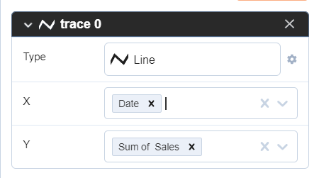
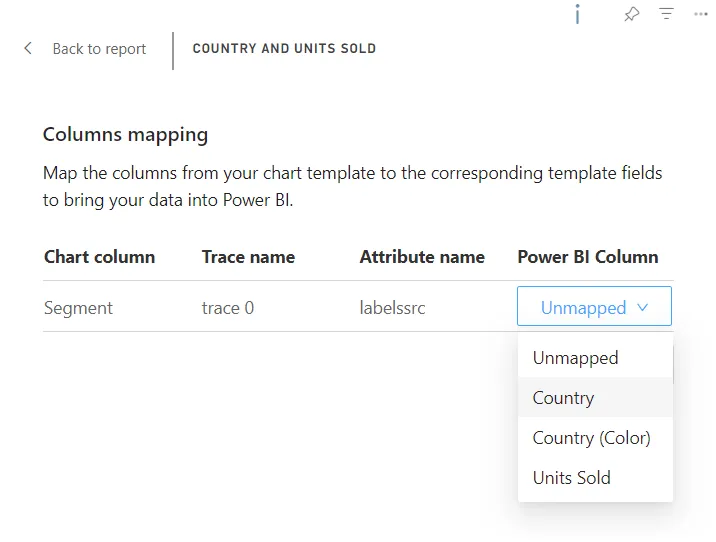

# Data binding/Data mapping

Each time when users assign columns in trace at the trace tab in Chart Studio, Plotly.js creates attributes with data and reference.



Trace an object in the JSON document after assigning the columns to Values and Labels of Pie chart:

```json
"data": [
    {
        "type": "scatter",
        "mode": "markers",
        "x": [
            161263.5,
            168552,
            470673.5,
            172178,
            153139
        ],
        "xsrc": "Units Sold",
        "meta": {
            "columnNames": {
                "values": "Units Sold",
                "labels": "Segment",
                "marker": {
                  "symbol": "Shape",
                  "color": "Country (Color)"
                 }
            }
        },
        "labels": [
            "Channel Partners",
            "Enterprise",
            "Government",
            "Midmarket",
            "Small Business"
        ],
        "labelssrc": "Segment",
        "marker": {
            "symbolsrc": "Shape",
            "symbol": [
                 "triangle-ne",
                 "circle",
                 "square",
                 "triangle-sw",
                 "cross",
            ],
            "color": [
                 "#118DFF",
                 "#12239E",
                 "#E66C37",
                 "#6B007B",
                 "#E044A7",
            ],
            "colorsrc": "Country (Color)"
        }
    }
]
```

You can see that `labels` and `values` arrays contain data from Power BI. You can also see that the `meta` object has a list of used columns in the `columnNames` object.

Also, there are three other properties `xssrc`, `labelssrc`, `symbolsrc` (inside `marker` object) with column names from Power BI to bind data from Power BI to the Plotly.js library.

Each time when the user loads chart JSON into the visual, the visual checks the columns from `columnNames` and `<property name>src` to ensure that the visual has those columns filed well in the bucket. If the visual doesn’t find a match, it displays a mapping view to remap columns to the property.



After selecting the new columns for the chart, the visual loads the chart view or Chart studio to continue editing the chart JSON.