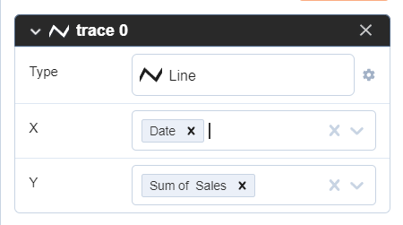
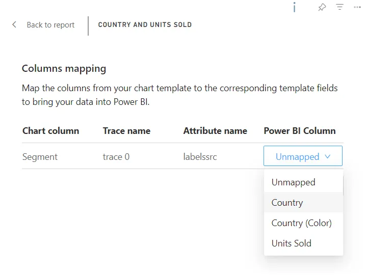

# Data binding/Data mapping

The PlotlyJS Visual for Power BI provides powerful ways to connect your data to chart properties. This process is called data binding or data mapping. Understanding how it works allows you to create robust, reusable, and complex visualizations.

There are two main ways to bind data:

1. **Standard Data Binding**: The default method used by the Chart Studio editor. It's straightforward and covers most use cases.
2. **Advanced Data Binding with Handlebars.js**: A flexible method for advanced users to dynamically generate JSON configuration from your data.

## Standard Data Binding

When you assign data columns to a trace in the Chart Studio editor, the visual automatically performs data binding.



This process involves two key actions:

1. **Writing Data**: The actual data values from your Power BI columns are written into the corresponding arrays in the trace object (e.g., `x`, `y`, `labels`, `marker.color`).
2. **Storing References**: To maintain the link to the Power BI data source for refreshes and re-mapping, the visual stores references to the column names in two places:
    * In properties ending with `src` (e.g., `xsrc`, `labelssrc`, `colorsrc`).
    * Inside a `meta.columnNames` object.

Here is an example of a trace object in the JSON document after assigning several columns:

```json
"data": [
    {
        "type": "scatter",
        "mode": "markers",
        "x": [
            161263.5,
            168552,
            470673.5,
            172178,
            153139
        ],
        "xsrc": "Units Sold",
        "labels": [
            "Channel Partners",
            "Enterprise",
            "Government",
            "Midmarket",
            "Small Business"
        ],
        "labelssrc": "Segment",
        "marker": {
            "symbol": [
                 "triangle-ne",
                 "circle",
                 "square",
                 "triangle-sw",
                 "cross"
            ],
            "symbolsrc": "Shape",
            "color": [
                 "#118DFF",
                 "#12239E",
                 "#E66C37",
                 "#6B007B",
                 "#E044A7"
            ],
            "colorsrc": "Country (Color)"
        },
        "meta": {
            "columnNames": {
                "values": "Units Sold",
                "labels": "Segment",
                "marker": {
                  "symbol": "Shape",
                  "color": "Country (Color)"
                 }
            }
        }
    }
]
```

You can see that `labels` and `values` arrays contain data from Power BI. You can also see that the `meta` object has a list of used columns in the `columnNames` object.

Also, there are three other properties `xssrc`, `labelssrc`, `symbolsrc` (inside `marker` object) with column names from Power BI to bind data from Power BI to the Plotly.js library.
Also, there are three other properties `xssrc`, `labelssrc`, `symbolsrc` (inside `marker` object) with column names from Power BI to bind data from Power BI to the Plotly.js library.

Each time when the user loads chart JSON into the visual, the visual checks the columns from `columnNames` and `<property name>src` to ensure that the visual has those columns filed well in the bucket. If the visual doesn’t find a match, it displays a mapping view to remap columns to the property.



After selecting the new columns for the chart, the visual loads the chart view or Chart studio to continue editing the chart JSON.

## Handlebars.js template inserts

The visual support Handlebars.js templates inserts. It allows to user generate JSON configuration by using templates and bind data to JSON configuration in advanced approach.

The template inserts are JSON properties with keys that starts by `HBT<n>`, where `<n>` is an number. And values are template strings.

### `column` helper

The helper returns an array of values for the given single column name.

```json5
{
    // ...
    HBT1: 'x2: {{{ column "Country" }}}',
    // ...
}
```

The helper returns `x2: ["USA", "Canada", "Mexico"]` if the column `Country` has values `USA`, `Canada`, `Mexico`.

### `select` helper

The helper returns an array of object with values for the given column names.

Example:

```json5
{
    // ...
    HBT1: 'x2: {{{ select "Country", "City" }}}',
    // ...
}
```

The helper returns

```json5
{
    // ...
    x2: [{Country:"USA", City:"New York"}, {Country:"Canada", City:"Toronto"}, {Country:"Mexico", City:"Mexico City"}]
    // ...
}
```

If the columns `Country` and `City` have values `USA`, `Canada`, `Mexico` and `New York`, `Toronto`, `Mexico City` respectively.

### `map` helper

The helper returns an values of given property from for the given array of objects.

Example:

```json5
{
    // ...
    HBT1: 'x2: {{{ map "Country" (select "Country", "City") }}}',
    // ...
}
```

Return array of values of `Country` column:

```json5
{
    // ...
    "x2": ["USA", "Canada", "Mexico"]
    // ...
}
```

Where `(select "Country", "City")` is helper that returns array of objects:

```json5
[
    { "Country": "USA", "City": "New York" },
    { "Country": "Canada", "City": "Toronto" },
    { "Country": "Mexico ", "City"}
]
```
