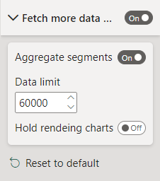
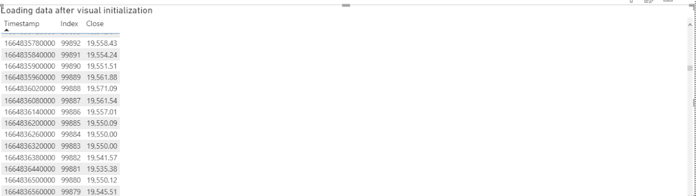
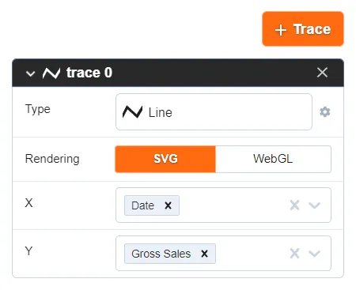
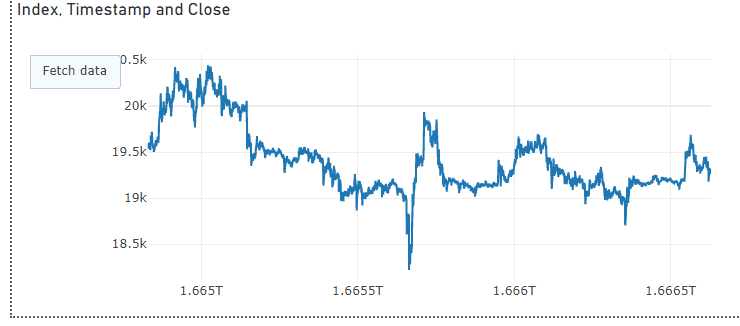

# Fetch more data

By default, Power BI visuals have a limitation of one thousand data points. However, visual developers can extend it up to 30,000 data points. Additionally, visuals can call [Fetch More Data API](https://learn.microsoft.com/en-us/power-bi/developer/visuals/fetch-more-data) to load more data.



The Plotly.js visual uses this API to load the next 30,000 data points. When the user enables the property in the visual formatting panel after the first update, the visual call API loads the next 30,000 data points immediately, before rendering the chart. The Plotly.js in the visual can visualize 60,000 data points by default.

Users can extend the limit to load up to 100MB of data to the visual through the setup “Data limit” property.

`Aggregate segments` property allows users to keep previous data on loading the next part of data instead dropping.

Here is an example of using this feature of loading more data.



To avoid performance degradation on rendering enormous amounts of data, it is recommended to use WebGL rendering instead of SVG.



## Fetch More Data by button

The layout section of Plotly.js supports buttons:

```json
"updatemenus": [
    {
        "buttons": [
            {
            "args": [
                {
                    "aggregateSegments": true
                }
            ],
            "label": "Fetch data",
            "method": "fetchMoreData",
            "name": "fetchMoreData"
            }
        ],
        "type": "buttons"
    }
]
```

The visual handles a click on the button `Fetch data`, and calls Fetch More Data API

The button name and method are `fetchMoreData`, and it’s mandatory to use API.


