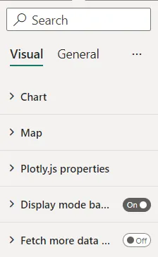

# Visual formatting options

The visual has properties to configure the behavior of the chart and visual.

the user can hide display mode buttons, configure fetch more data options settings etc. if they are necessary.