# Highlights

Highlights on the visual [allow showing sections of data](https://learn.microsoft.com/en-us/power-bi/create-reports/power-bi-reports-filters-and-highlighting) related to selected data points in other visuals.

To create such visualization in the PlotlyJS Visual, the visual provides highlighted values as a regular column of the table:

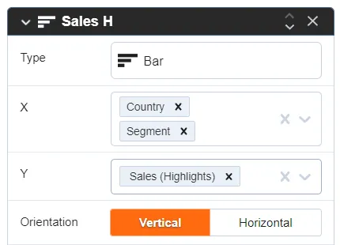

The values of those columns always are less than the values of the corresponding un-highlighted columns.

To add highlights for charts, you need to enable the property in the visual settings:

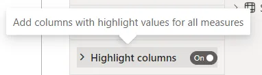

Then create the second bars behind and assign different columns (highlight and values columns) for them.

Click on “+ Trace” to add a new trace to the chart:

New trace:

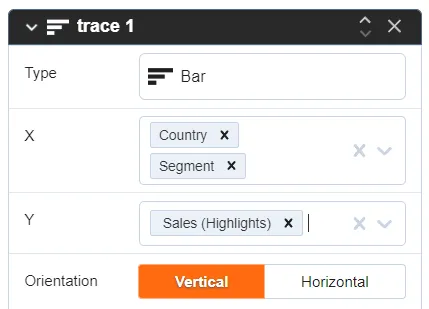

Assign `Country` and `Segment` columns to X axis. Assign `Sales (Highlights)` to Y axis.

After that, you will have a chart with new columns:

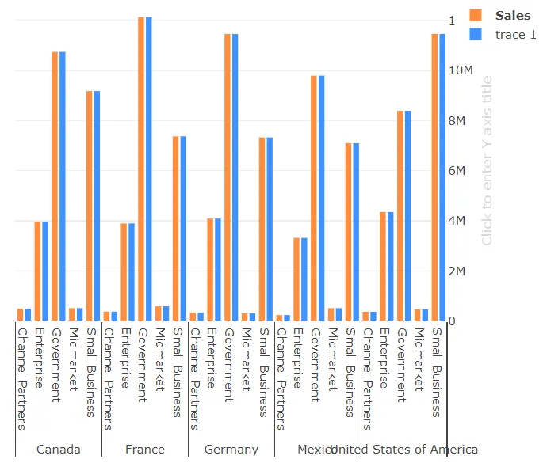

Change the opacity of the first trace in the styles section:

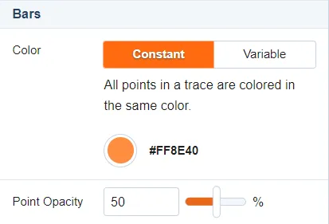

Those bars will be behind the chart to visualize the un-highlighted values.

Add the new X axis for the second trace (Name is `trace 1`) in the Trace tab of the editor in the `Axes to Use` panel:

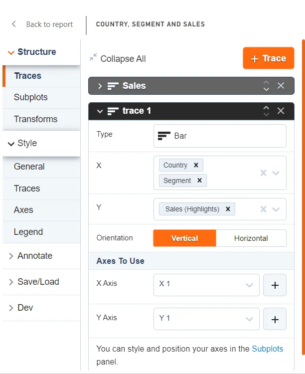

After that, the chart shifts the `trace 1` to the foreground and adds the second X axis on top:

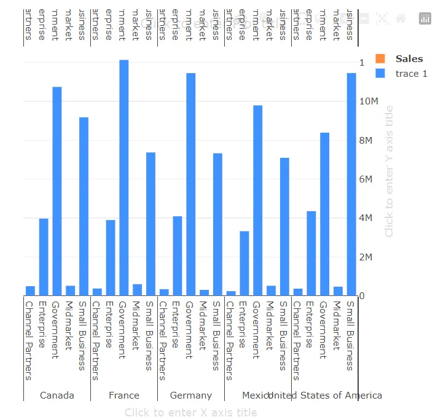

We don’t need the second X axis (xaxis2) for hiding it, you just need to set false for the “visible” property in the JSON editor:

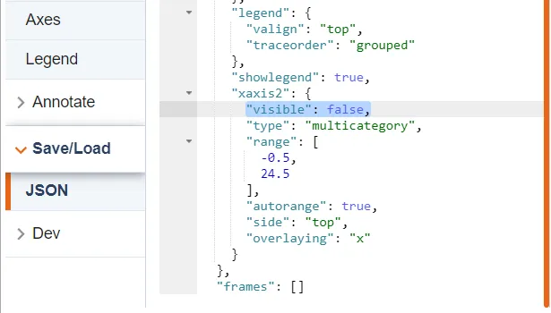

It almost ready — you can save and interact with other visuals in the Power BI report to see the result:

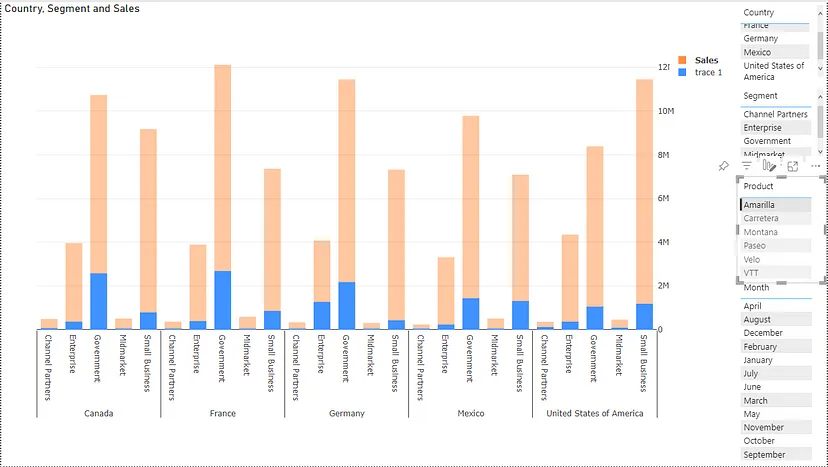

The final part is color — you need to set the same color for the second trace too in the “Styles” tab:

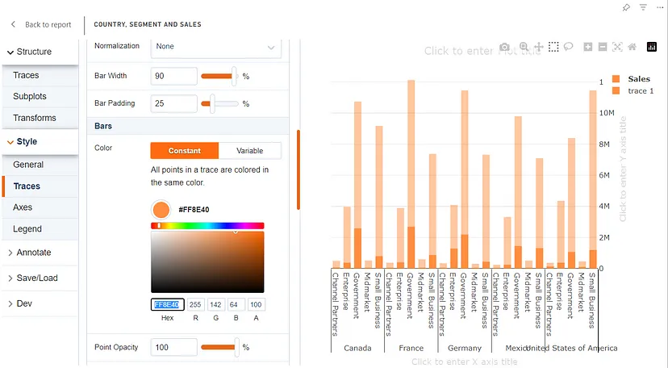

Hide the legend, as we don’t need it here for single trace:

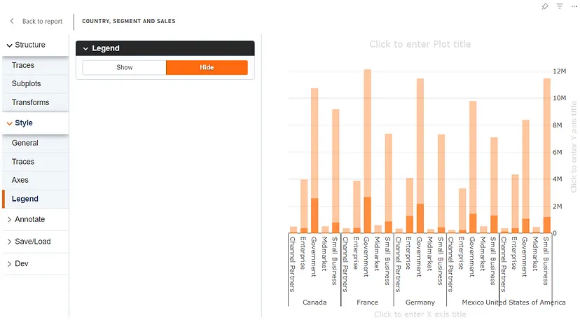