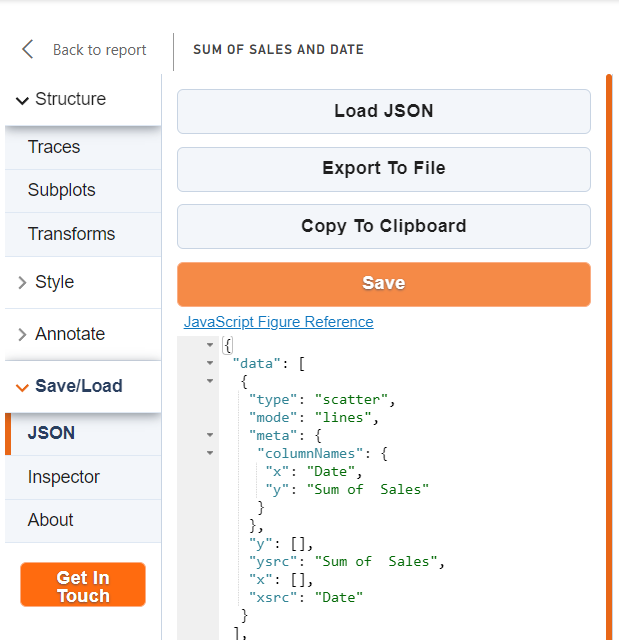

# Import and export chart JSON

The visual supports Export and Import charts. Users can reuse configured charts in other reports or dashboards.

`Load JSON` — imports a JSON file from a disk.

`Export To File` — saves a JSON document in a disk. It requires File Download API access. Power BI admins in your organization must enable it for visuals.

`Copy To Clipboard` — another option to export the chart if File Download API is disabled. It copies the JSON document to the clipboard.

`Save` — saves the chart in the visual properties.