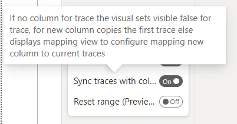
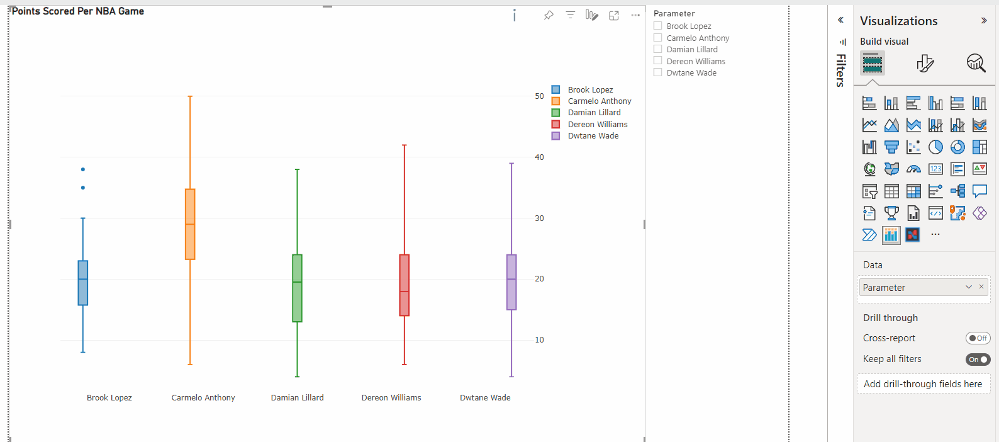
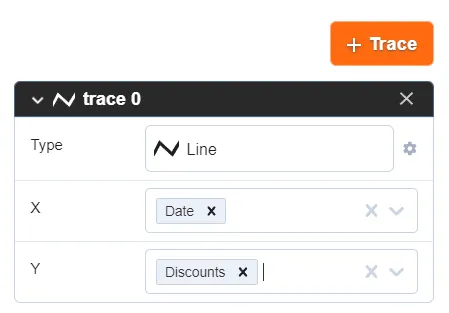
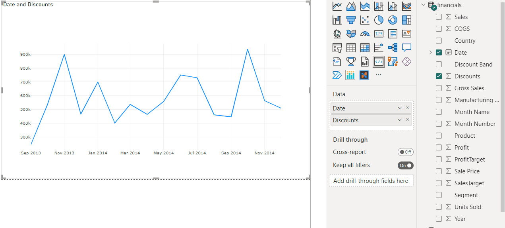

# Sync traces with columns

:::note

The visual version 1.5.0 or above is required

:::

By default, the visual expects that the chart has a fixed count of traces. To improve reusability, users can enable the sync traces property.



When the property is enabled, the visual assumes that one column is used for each trace property of the chart. It will also sync the trace count and the trace data with columns in the visual. The property was introduced to support the field parameters of Power BI.



The visual has properties to configure the sync traces feature in powerbi section of JSON schema:

```json
"powerbi": {
    "syncTracesByColumns": {
        "ignoreKeys": ["xsrc"],
        "ignoreColumns": ["Date"]
    }
}
```

The visual ignores sync for given properties or columns.

## Sync traces property use case

Need to create the multiple line charts with common x axis of date vaalues.

The chart has one trace with measure values (`Discounts` and `Date` for `x` axis):



When `syncTracesByColumns` enabed user can add new columns of measure and visual will create copy of trace. But copying trace for `Date` column or `xsrc` attribute is useless.

To avoid the behavior need to specify `xsrc` attribute in `ignoreKeys` array.

For example:


