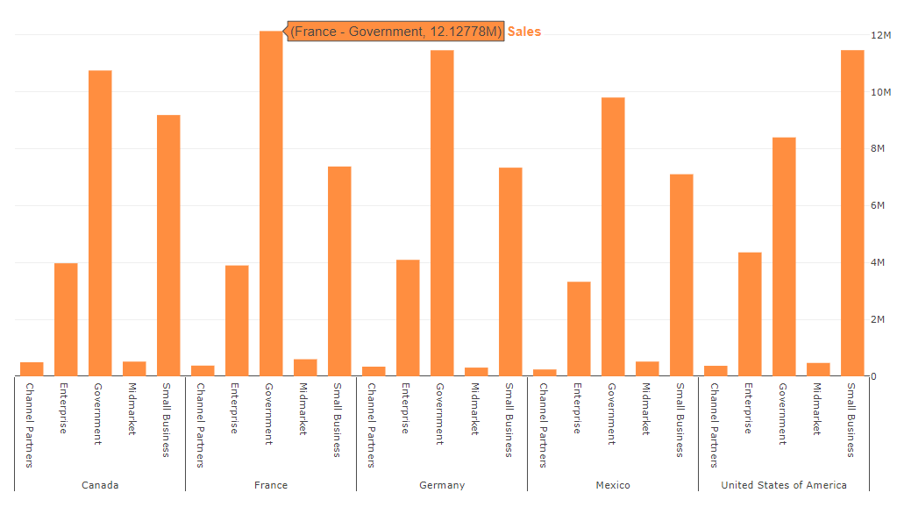
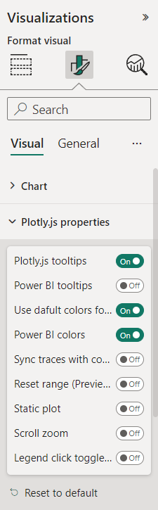
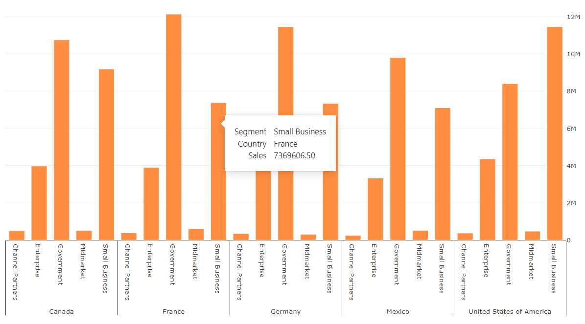
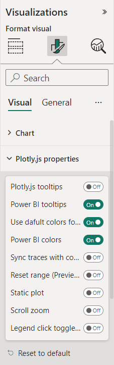

# Tooltips

Tooltips are an elegant way of providing contextual information and detail to data points on a visual.

:::note

The visual version 1.6.0 or above is required

:::

## Plotly.JS tooltips

By default, plotly.js shows tooltips for traces on mouse hover over datapoints. There are columns names and correspond to datapoint values.



Switch on "Plotly.js tooltips" in visual formatting panel to use tooltips provided by Plotly.js library.



### hoverformat

Provides format options for axes. Example:

```json
{
    "data": [],
    "layout": {
        "xaxis": {
          "hoverformat": "%y/%m/%d",
          "range": [
            "2013-09-01",
            "2014-12-01"
          ],
          "autorange": true,
          "type": "date"
        }
    }
}
```

provides formatting option for x axis as `%y/%m/%d` for date format.


For numbers, see [D3.js documentation](https://github.com/d3/d3-format/tree/v1.4.5#d3-format)

### hovertemplate

Template string used for rendering the information that appear on hover box. Note that this will override `hoverinfo`. Variables are inserted using %{variable}, for example "y: %{y}" as well as %{xother}, {%_xother}, {%_xother_}, {%xother_}. When showing info for several points, "xother" will be added to those with different x positions from the first point. [Read details in documentation](https://plotly.com/javascript/reference/scatter/#scatter-hovertemplate)

Example: 

```json
{
    "data": [
        {
            "type": "scatter",
            "hovertemplate": "<i>Price</i>: $%{y:.2f}<br><b>X</b>: %{x}<br><b>%{text}</b>",
        }
    ]
}
```

[Read more about Plotly.js tooltips in official documentation](https://plotly.com/javascript/hover-text-and-formatting/)

## Power BI Tooltips

The visual supports tooltips provided by Power BI also. The feature requires [purchase the license](https://appsource.microsoft.com/en-us/marketplace/checkout/akvelon.plotlyjsvisualbyakvelon) in Appsource.

Currently, the following Power BI environments don't require license purchasing for the PlotlyJS visual feature:

* Embedded - Publish To Web, PaaS embed
* National/Regional clouds (Depends on general support for transactability in national/regional clouds)
* RS Server
* Exporting (PDF\PPT) using REST API

[Read about how to purchase a visual license](https://learn.microsoft.com/en-us/power-bi/developer/visuals/licensing-faq#purchasing) and [assign the license to users](https://learn.microsoft.com/en-us/power-bi/developer/visuals/licensing-faq#license-assignment). 

[Read more about purchasing Power BI visuals in official documentation](https://learn.microsoft.com/en-us/power-bi/developer/visuals/licensing-faq#license-assignment).



Switch on "Power BI tooltips" in visual formatting panel to use tooltips provided by Power BI visuals API.



The columns and properties of tooltip can be configured in `powerbi` config of the JSON file.

```json
"powerbi": {
    "tooltipData": [
        {
            "columnIsHeader": true,
            "displayName": "Header text should be the first"
        },
        {
            "header": "Or another Custom header",
        },
        {
            "column": "Country"
        },
        {
            "column": " Sales",
            "format": "$.2f"
        },
        {
            "displayName": "Custom display of sales value",
            "column": " Sales",
            "format": "$.2f"
        },
        {
            "column": "Country",
            "displayName": "Custom text",
            "value": "your const value"
        },
        {
            "displayName": "Custom text 2",
            "value": "your const value 2"
        }
    ]
}
```

### `column` property

Sets column for display value and data value from dataset

### `columnIsHeader` proeprty

Sets column header as tooltip header

### `header` proeprty

Sets custom constant value as tooltip header

### `format` property

Sets formatting for numerical and date values

### `displayName` property

Sets custom constant display name for tooltip row. The property override column header from dataset

### `value` proeprty

Sets custom constant value for tooltip row