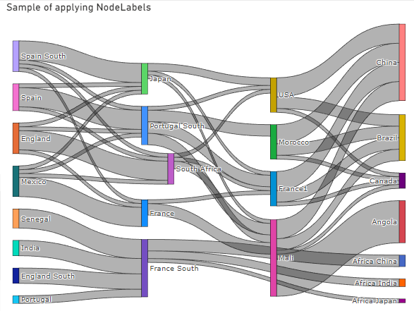
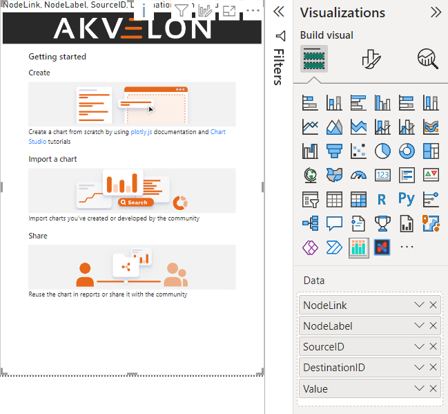
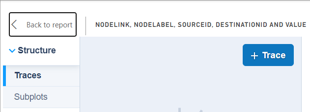
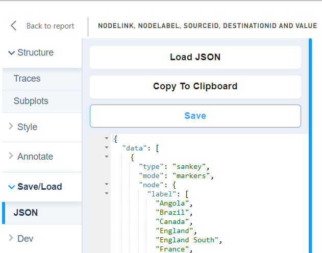
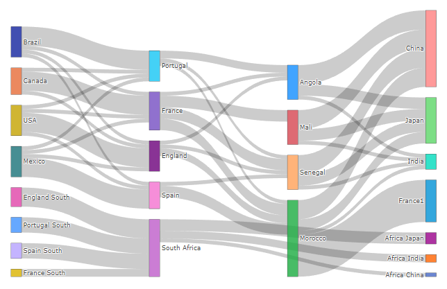

# Sankey tutorial

The visuals allows the creation of Sankey charts. This is creating a sample chart and preparing data in Power BI Desktop for rendering Sankey chart by PlotlyJS Visual.



In this tutorial [`SankeyMicrosoftSample`](https://appsource.microsoft.com/en-US/product/power-bi-visuals/WA104380777?exp=ubp8&tab=Overview) report was used for data imported from Microsoft Sankey visual sample report.

## Prepare data
To set node labels on the chart correctly, you have to transform your table to the next state:

|Source        |Destination |Value|SourceIndex|DestinationIndex|NodeLabel     |
|--------------|------------|-----|-----------|----------------|--------------|
|Angola        |China       |5    |0          |17              |Angola        |
|Angola        |India       |1    |0          |18              |Brazil        |
|Angola        |Japan       |3    |0          |19              |Canada        |
|Brazil        |England     |1    |1          |3               |England       |
|Brazil        |France      |1    |1          |5               |England South |
|Brazil        |Portugal    |5    |1          |10              |France        |
|Brazil        |Spain       |1    |1          |14              |France South  |
|Canada        |England     |1    |2          |3               |Mali          |
|Canada        |France      |5    |2          |5               |Mexico        |
|Canada        |Portugal    |1    |2          |10              |Morocco       |
|England       |Angola      |1    |3          |0               |Portugal      |
|England       |Morocco     |2    |3          |9               |Portugal South|
|England       |Senegal     |1    |3          |12              |Senegal       |
|England South |South Africa|5    |4          |13              |South Africa  |
|France        |Angola      |1    |5          |0               |Spain         |
|France        |Mali        |3    |5          |7               |Spain South   |
|France        |Morocco     |3    |5          |9               |USA           |
|France        |Senegal     |3    |5          |12              |China         |
|France South  |South Africa|2    |6          |13              |India         |
|Mali          |China       |5    |7          |17              |Japan         |
|Mali          |India       |1    |7          |18              |France1       |
|Mali          |Japan       |3    |7          |19              |Africa China  |
|Mexico        |England     |1    |8          |3               |Africa India  |
|Mexico        |France      |1    |8          |5               |Africa Japan  |
|Mexico        |Portugal    |1    |8          |10              |              |
|Mexico        |Spain       |5    |8          |14              |              |
|Morocco       |China       |5    |9          |17              |              |
|Morocco       |France1     |11   |9          |20              |              |
|Morocco       |India       |1    |9          |18              |              |
|Morocco       |Japan       |3    |9          |19              |              |
|Portugal      |Angola      |2    |10         |0               |              |
|Portugal      |Morocco     |1    |10         |9               |              |
|Portugal      |Senegal     |1    |10         |12              |              |
|Portugal South|South Africa|4    |11         |13              |              |
|Senegal       |China       |5    |12         |17              |              |
|Senegal       |India       |1    |12         |18              |              |
|Senegal       |Japan       |3    |12         |19              |              |
|South Africa  |Africa China|1    |13         |21              |              |
|South Africa  |Africa India|2    |13         |22              |              |
|South Africa  |Africa Japan|3    |13         |23              |              |
|Spain         |Morocco     |3    |14         |9               |              |
|Spain         |Senegal     |1    |14         |12              |              |
|Spain South   |South Africa|4    |15         |13              |              |
|USA           |England     |5    |16         |3               |              |
|USA           |France      |1    |16         |5               |              |
|USA           |Portugal    |1    |16         |10              |              |
|USA           |Spain       |1    |16         |14              |              |

There is 'NodeLabel' column with labels for a node with unique values on top (it’s crucial to build Sankey properly).

We need to add an Index column to the source table 'SankeyMicrosoftSample'; the index will use as a foreign key to join with the source column.

To add node names, we need to apply a query to 'SankeyMicrosoftSample'.
Let’s overview each row step by step to understand it.

```dax
let
	// We use “SankeyMicrosoftSample” table as a source
	Source = SankeyMicrosoftSample,
	// Then we create two tables, one for source nodes, and another for destination nodes
	// Remove all columns except the “Source” column
	DestinationNodes = Table.RemoveColumns(Source,{"Source", "Value", "NodeLink"}),
	// Then rename it to the “Nodes” column.
	DestinationNodesRanmed = Table.RenameColumns(DestinationNodes, {{"Destination", "Nodes"}}),
	
	// Do the same for Destination nodes. 
	// Remove all columns except the “Destination” columns.
	SourceNodes = Table.RemoveColumns(Source,{"Destination", "Value", "NodeLink"}),
	// Then also, rename it to the “Nodes” column.
	SourceNodesRenamed = Table.RenameColumns(SourceNodes,{{"Source", "Nodes"}}),
	
	// Because we need only one column with all node labels, combine those two tables with “Node” columns
	Combination = Table.Combine({SourceNodesRenamed, DestinationNodesRanmed}),
	// Then get distinct values by applying Table.Distinct function
	DistinctNodes = Table.Distinct(Combination),
	// To join with the  source column, 
	// Add an Index column to our Table with distinct “Nodes” table
	NodesList = Table.AddIndexColumn(DistinctNodes, "Index", 0, 1, Int64.Type),
	
	// The last step is to join two tables (SankeyMicrosoftSample, NodesList)
	LeftJoin = Table.AddJoinColumn(SankeyMicrosoftSample, "NodeLink", NodesList, "Index", "NodeLabel"),
	// Expand the NodeLabel column. It doesn’t need an index column from the NodesList table.
	Expand = Table.ExpandTableColumn(LeftJoin, "NodeLabel", {"Nodes"}, {"NodeLabel"}),
	
	// Add IDs for source and destination node because PlotlyJS expects numbers instead of string
	// Add SourceID
	SourceID = Table.AddJoinColumn(Expand, "Source", NodesList, "Nodes", "SourceID"),
	// Expand the table to get SourceID column only
    ExpandedSourceID = Table.ExpandTableColumn(SourceID, "SourceID", {"Index"}, {"SourceID"}),

	// Add DestinationID
	DestinationID = Table.AddJoinColumn(ExpandedSourceID, "Destination", NodesList, "Nodes", "DestinationID"),
	// Expand the  table to get DestinationID column only
    ExpandedDestinationID = Table.ExpandTableColumn(DestinationID, "DestinationID", {"Index"}, {"DestinationID"})

	// Return result
in
	ExpandedDestinationID
```

## Configure Sankey chart in PlotlyJS chart

When data is ready, create the visual instance on a report page and assign `NodeLink`, `NodeLabel`, `SourceID`, `DestinationID`, and `Value` columns to the visual instance:



Enter edit mode by clicking on `Edit` in the visual menu and click `+Trace`:



Then switch trace type `Sankey` by selecting trace on the list.

The last step is assigning columns to properties:

`NodeLabel` to Labels

`SourceID` to Sources

`DestinationID` to Target

`Value` to Values

and save the chart in the `Save/Load` tab:



The final result is:

