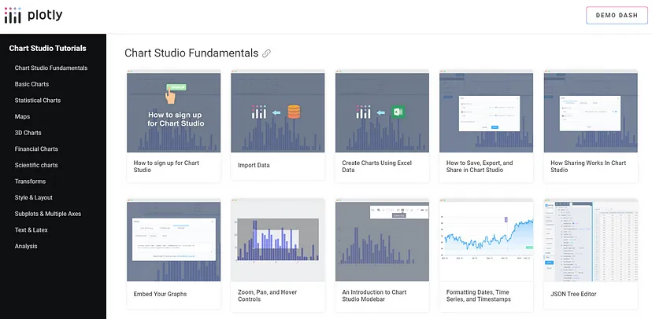
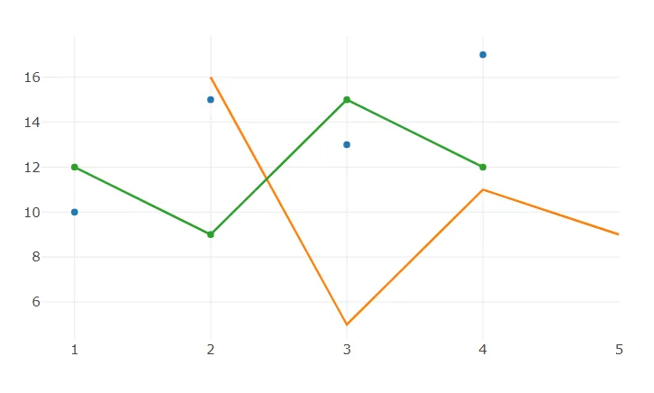
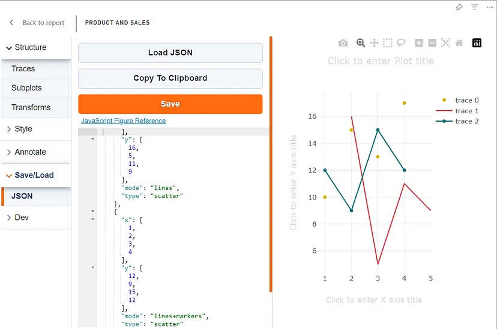

# Plotly.js documentation

Chart Studio in the visual and Dash website have the same bases, and users can use [official tutorials of Chart Studio from the web site](https://plotly.com/chart-studio-help/tutorials/#basic). The main difference is connecting data and exporting charts. Visual users in Power BI just need to assign columns to the visuals from a Power BI data model.



On the website with tutorials, users can find examples of configuring different basic and complex types of charts. Users should skip the “Add Data” section in those tutorials.

The Plotly.js library is behind the visuals, which also has [its own documentation, where described properties](https://plotly.com/javascript/#basic-charts) and features aren’t available if you use only Chart Studio capabilities and ignore JSON editor to configure your own chart.

## Adopting JS code samples to JSON chart schema in PlotlyJS Visual

Let’s use an example of configuring the Scatter Plot from Plotly.js documentation on this page:

https://plotly.com/javascript/line-and-scatter/

```javascript
var trace1 = {
  x: [1, 2, 3, 4],
  y: [10, 15, 13, 17],
  mode: 'markers',
  type: 'scatter'
};

var trace2 = {
  x: [2, 3, 4, 5],
  y: [16, 5, 11, 9],
  mode: 'lines',
  type: 'scatter'
};

var trace3 = {
  x: [1, 2, 3, 4],
  y: [12, 9, 15, 12],
  mode: 'lines+markers',
  type: 'scatter'
};

var data = [trace1, trace2, trace3];

Plotly.newPlot('myDiv', data);
```

as well as the result of the chart below:




There, we see three trace objects to configure three different scatter charts.

In JSON editor of Chart studio, users can see an `"empty"` JSON document:

```json
{
    "data": [],
    "layout": {},
    "frames": {}
}
```

The Plotly.js JSON document has three roots that are [described declaratively as JSON objects](https://plotly.com/javascript/reference/index/#scatter-x): data, frame, layout.

To reuse the code above in the visual, we need to put three traces into the data array:

```json
{
  "data": [
    {
      "x": [1,2,3,4],
      "y": [10,15,13,17],
      "mode": "markers",
      "type": "scatter"
    },
    {
      "x": [2,3,4,5],
      "y": [16,5,11,9],
      "mode": "lines",
      "type": "scatter"
    },
    {
      "x": [1,2,3,4],
      "y": [12,9,15,12],
      "mode": "lines+markers",
      "type": "scatter"
    }
  ],
  "layout": {
  },
  "frames": []
}
```

There, we need to add quotes to property names because it is JSON. After saving the chart, you will see the result:



Plotly.js adds a default config for layout property according to values in the data property.